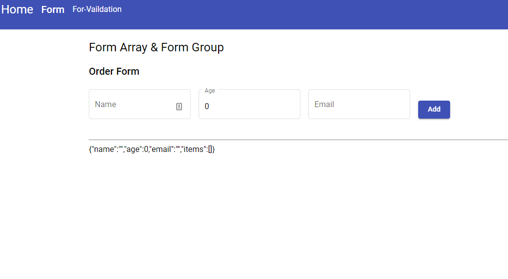
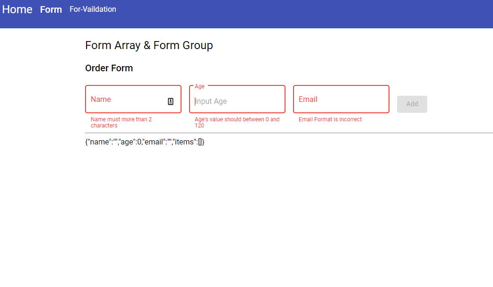
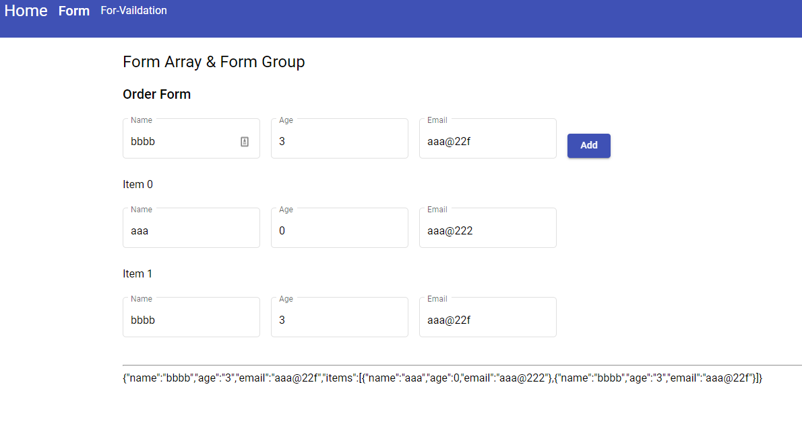

# ItnerviewTest

Please follow these pictures to coding similar result

# Initialized

# Error Check

# Add Item

## Upload your code into this repository
## Tips: if you use angular material, [material.module.ts](./material.module.ts) will help you